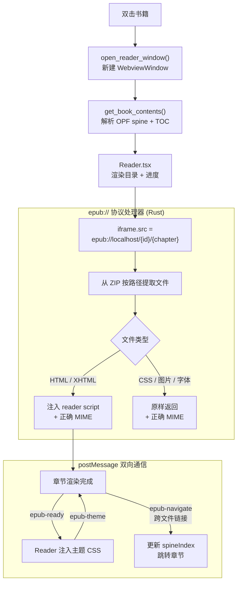

# CLAUDE.md

This file provides guidance to Claude Code (claude.ai/code) when working with code in this repository.

## Commands

```bash
# Development
npm run tauri dev          # Start dev server (Vite + Rust hot-reload)

# Build
npm run tauri build        # Production build (outputs to src-tauri/target/release/bundle/)

# Frontend only
npm run dev                # Vite dev server at localhost:1420 (no Rust, UI-only iteration)
npm run build              # tsc + vite build (type-check + bundle)

# Rust only
cd src-tauri && cargo check          # Fast type/borrow check without linking
cd src-tauri && cargo clippy         # Lint Rust code
```

## Tests

```bash
npm test                               # frontend (Vitest, pure-logic only)
cd src-tauri && cargo test --lib       # Rust unit tests (18 tests)
```

## Architecture

This is a **Tauri 2** desktop app (macOS-only target) with a React/TypeScript frontend and a Rust backend.

### Data flow

All business logic lives in Rust. The frontend calls Rust commands via `invoke()` from `@tauri-apps/api/core` and receives serialized data back — there is no direct filesystem access from JS.

EPUB chapter content is served via a custom `epub://` URI scheme protocol registered in Rust. The reader iframe loads chapters directly by URL — no third-party EPUB renderer.

#### 导入书籍流程


#### 阅读器核心流程



### Rust backend (`src-tauri/src/lib.rs`)

Single file — all logic is here. Key types:

- `Book` — id (uuid), title, author, path, cover (base64 data URL), added_at (unix secs), source_folder
- `Library` — `books: Vec<Book>` + `folders: Vec<String>`
- `SpineItem` — href (path from EPUB root), id
- `TocEntry` — label, href, children (recursive)
- `BookContents` — spine + toc, returned by `get_book_contents`

Persistence: `Library` is serialized to `~/Library/Application Support/com.lielienan.local-books/library.json` via `app.path().app_data_dir()`.

**EPUB metadata pipeline** (`extract_epub_metadata`):
1. Open `.epub` as ZIP → read `META-INF/container.xml` → find OPF path
2. Parse OPF with `roxmltree` → extract title, creator, cover image path
3. Base64-encode cover as data URL

**EPUB contents pipeline** (`parse_epub_contents`):
1. Parse OPF manifest + spine → ordered `Vec<SpineItem>` (linear items only)
2. TOC: prefers EPUB3 `nav.xhtml` (`epub:type="toc"`), falls back to EPUB2 `toc.ncx`
3. All hrefs are normalized to paths relative to the EPUB root (e.g. `OEBPS/Text/ch01.xhtml`)

**epub:// protocol handler** (`serve_epub_protocol`):
- `epub://localhost/{book_id}/book.epub` → serves full binary (legacy, unused)
- `epub://localhost/{book_id}/{file_path}` → extracts that file from the ZIP, serves it with correct MIME type
- HTML/XHTML files get a script injected before `</body>` that: intercepts cross-file link clicks (posts `epub-navigate` message to parent), applies theme CSS received via `epub-theme` postMessage, and signals readiness with `epub-ready`

Exposed Tauri commands: `pick_folder`, `import_folder`, `get_library`, `remove_book`, `remove_folder`, `refresh_folder`, `open_reader_window`, `get_book_contents`.

### Frontend (`src/`)

- `App.tsx` — bookshelf root; owns `Library` state; detects reader window via `window.__READER_BOOK_ID__`
- `BookCard` — cover + right-click context menu
- `FolderSidebar` — watched folders panel
- `Reader.tsx` — custom EPUB reader (no epub.js)
- `Reader.css` — reader-specific styles

**Reader architecture** (no third-party EPUB library):

```
Rust: get_book_contents → spine + TOC
Reader: <iframe src="epub://localhost/{id}/{chapter.href}">
iframe script → postMessage("epub-navigate") → Reader navigates spine
Reader → postMessage("epub-theme", css) → iframe applies theme
```

- Chapter navigation: prev/next buttons, keyboard arrows, TOC clicks, in-chapter links
- Theme/font-size injected via postMessage CSS (no iframe reload needed)
- Cross-file footnote links handled by the injected script → parent decides whether to navigate or show popup
- Progress shown as spine index percentage

Styling: plain CSS, no framework. `prefers-color-scheme` handled by the bookshelf; reader has explicit light/sepia/dark themes.

### Tauri configuration

- `src-tauri/tauri.conf.json` — 1200×800 main window, `titleBarStyle: "Overlay"`
- `src-tauri/capabilities/default.json` — main window: `core:default`, `core:window:allow-start-dragging`, `dialog:*`, `opener:default`
- `src-tauri/capabilities/reader.json` — reader windows (`reader-*`): `core:default`, `core:window:allow-start-dragging`

### Adding a new Rust command

1. Write `async fn` in `lib.rs`, annotated `#[tauri::command]`
2. Register in `tauri::generate_handler![...]` inside `run()`
3. Call from frontend: `invoke<ReturnType>("command_name", { argName })`

## UI Design Style

**Liquid Glass (macOS 26 style)** — only panels use frosted glass; main content areas stay solid.

Glass components: sidebar (floating, `margin: 8px 0 8px 8px`, `border-radius: 12px`), context menu, reader TOC panel, reader settings panel.
No glass: titlebar, book grid/cards, reader body.

Blur hierarchy: TOC panel `blur(32px)` > sidebar/settings `blur(28px)` > context menu `blur(24px)`, all with `saturate(160%/150%)`.
Always pair `-webkit-backdrop-filter` with `backdrop-filter`.

Dark mode: bookshelf uses `@media (prefers-color-scheme: dark)` in App.css; reader uses JS-controlled classes (`.toc-panel--dark`, `.reader-settings--dark`).

## CSS Gotchas

**`overflow-y: auto` + `::before` highlight line** — the pseudo-element scrolls away with content. Use non-uniform `border-top` (brighter) instead of `::before`.
`overflow: hidden` is safe (static clip) — `::before { top: 0 }` won't be clipped.

**iframe scrollbar styling** — inject `::-webkit-scrollbar` CSS in Rust's `READER_SCRIPT` as a `<style>` tag. postMessage-injected CSS has timing issues for scrollbar rules.
