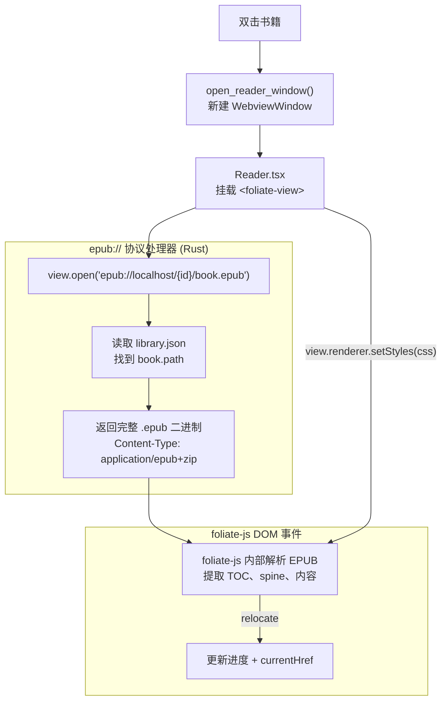

# CLAUDE.md

This file provides guidance to Claude Code (claude.ai/code) when working with code in this repository.

## Commands

```bash
# Development
npm run tauri dev          # Start dev server (Vite + Rust hot-reload)

# Build
npm run tauri build        # Production build (outputs to src-tauri/target/release/bundle/)

# Frontend only
npm run dev                # Vite dev server at localhost:1420 (no Rust, UI-only iteration)
npm run build              # tsc + vite build (type-check + bundle)

# Rust only
cd src-tauri && cargo check          # Fast type/borrow check without linking
cd src-tauri && cargo clippy         # Lint Rust code
```

## Tests

```bash
npm test                               # frontend (Vitest, pure-logic only)
cd src-tauri && cargo test --lib       # Rust unit tests
```

## Architecture

This is a **Tauri 2** desktop app (macOS-only target) with a React/TypeScript frontend and a Rust backend.

### Data flow

All business logic lives in Rust. The frontend calls Rust commands via `invoke()` from `@tauri-apps/api/core` and receives serialized data back — there is no direct filesystem access from JS.

EPUB rendering uses **foliate-js** (vendored at `vendor/foliate-js/`). The reader opens the book via a custom `epub://` URI scheme that serves the raw `.epub` binary — foliate-js handles all parsing internally.

#### 导入书籍流程


#### 阅读器核心流程



### Rust backend (`src-tauri/src/lib.rs`)

Single file — all logic is here. Key types:

- `Book` — id (uuid), title, author, path, cover (base64 data URL), added_at (unix secs), source_folder
- `Library` — `books: Vec<Book>` + `folders: Vec<String>`

Persistence: `Library` is serialized to `~/Library/Application Support/com.lielienan.local-books/library.json` via `app.path().app_data_dir()`.

**EPUB metadata pipeline** (`extract_epub_metadata`):
1. Open `.epub` as ZIP → read `META-INF/container.xml` → find OPF path
2. Parse OPF with `roxmltree` → extract title, creator, cover image path
3. Base64-encode cover as data URL

**epub:// protocol handler** (`serve_epub_protocol`):
- `epub://localhost/{book_id}/book.epub` → looks up `book.path` in library, returns the raw `.epub` file as `application/epub+zip`
- foliate-js in the frontend handles all EPUB parsing from this binary

Exposed Tauri commands: `pick_folder`, `import_folder`, `get_library`, `remove_book`, `remove_folder`, `refresh_folder`, `open_reader_window`.

### Frontend (`src/`)

```
src/
├── App.tsx              — 路由入口：检测 window.__READER_BOOK_ID__ 决定渲染书架或阅读器
├── App.css              — 书架全局样式
├── main.tsx             — React 挂载点
├── types/
│   └── foliate.ts       — 所有 foliate-js 接口类型（NavItem、FoliateViewElement 等）
├── components/          — 书架 UI 组件
│   ├── Bookshelf.tsx    — 书架主体，持有 Library 状态，调用 Tauri 命令
│   ├── BookCard.tsx     — 单本书卡片（双击打开）
│   └── FolderSidebar.tsx — 监控文件夹侧边栏
├── reader/              — 阅读器 feature，所有阅读器相关文件
│   ├── Reader.tsx       — 阅读器组件（组合 hooks + 子组件）
│   ├── Reader.css       — 阅读器样式
│   ├── ReaderSettings.tsx — 设置面板（主题/字体/排版）
│   ├── TocRow.tsx       — 目录列表行（递归）
│   ├── FootnotePopup.tsx — 脚注浮窗（Floating UI）
│   ├── readerTheme.ts   — Theme 类型、BG 色表、makeThemeCSS()
│   └── hooks/
│       ├── useFoliate.ts      — foliate-js 初始化、relocate 事件、脚注处理
│       └── useAutoHideUI.ts   — 顶栏/底栏自动隐藏计时器
└── lib/                 — 纯逻辑，无 React 依赖
    ├── utils.ts         — Book/Library 接口、filterBooks()
    ├── t2s.ts           — 繁简转换（convertText、convertDoc）
    └── t2sTable.ts      — 繁简字符映射表
```

**Reader architecture** (foliate-js):

```
Reader.tsx
├── useFoliate()  — 创建 <foliate-view>，open() 书籍，监听 relocate/load/link 事件
│                   返回 viewRef、toc、progress、currentHref、fnVisible 等
├── useAutoHideUI() — 鼠标静止 3s 后隐藏顶/底栏
└── JSX
    ├── ReaderSettings  — 设置面板
    ├── TocRow          — 目录列表
    └── FootnotePopup   — 脚注弹窗
```

- foliate-view 通过 `epub://localhost/{bookId}/book.epub` 加载书籍（Rust 协议处理器返回原始 .epub）
- Navigation: `view.prev()` / `view.next()` / `view.goTo(href)` — no spine index needed
- Theme/font-size applied via `view.renderer.setStyles()` (no reload needed)
- Progress from `relocate` event `detail.fraction` (0–1) or `detail.location.current/total`
- TOC loaded from `view.book.toc` (foliate-js NavItem tree)

Styling: plain CSS, no framework. `prefers-color-scheme` handled by the bookshelf; reader has explicit light/sepia/dark themes.

### Tauri configuration

- `src-tauri/tauri.conf.json` — 1200×800 main window, `titleBarStyle: "Overlay"`
- `src-tauri/capabilities/default.json` — main window: `core:default`, `core:window:allow-start-dragging`, `dialog:*`, `opener:default`
- `src-tauri/capabilities/reader.json` — reader windows (`reader-*`): `core:default`, `core:window:allow-start-dragging`

### Adding a new Rust command

1. Write `async fn` in `lib.rs`, annotated `#[tauri::command]`
2. Register in `tauri::generate_handler![...]` inside `run()`
3. Call from frontend: `invoke<ReturnType>("command_name", { argName })`

## UI Design Style

**Liquid Glass (macOS 26 style)** — only panels use frosted glass; main content areas stay solid.

Glass components: sidebar (floating, `margin: 8px 0 8px 8px`, `border-radius: 12px`), context menu, reader TOC panel, reader settings panel.
No glass: titlebar, book grid/cards, reader body.

Blur hierarchy: TOC panel `blur(32px)` > sidebar/settings `blur(28px)` > context menu `blur(24px)`, all with `saturate(160%/150%)`.
Always pair `-webkit-backdrop-filter` with `backdrop-filter`.

Dark mode: bookshelf uses `@media (prefers-color-scheme: dark)` in App.css; reader uses JS-controlled classes (`.toc-panel--dark`, `.reader-settings--dark`).

## Vendor Code Policy

`vendor/foliate-js/` is a **fork**, not a pristine vendored copy. Merge conflicts with upstream are **not a concern** — feel free to add or modify logic directly in vendor files when it's the cleanest solution. Already-customized files:

- `paginator.js` — scrollbar styles for scrolled flow; `afterLoad` style injection fix; `vertical` getter; `reloadSection()` method

## CSS Gotchas

**`overflow-y: auto` + `::before` highlight line** — the pseudo-element scrolls away with content. Use non-uniform `border-top` (brighter) instead of `::before`.
`overflow: hidden` is safe (static clip) — `::before { top: 0 }` won't be clipped.

**foliate-js scrollbar + reader styles** — pass all reader CSS (including `::-webkit-scrollbar` rules) via `view.renderer.setStyles(css)` through `makeThemeCSS()` in `reader/readerTheme.ts`. This is the single source of truth for the reader's visual appearance; do not inject styles by other means.
